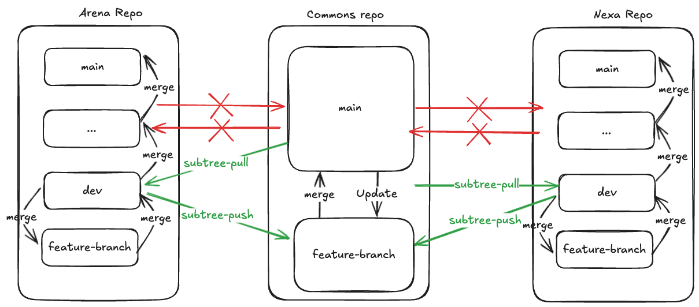

# Commons Subtree Workflow


This document outlines the workflow for managing the `commons` subtree, specifying that changes should be made in the `dev` branch of site repos and pushed to the `commons` repo only from `dev`. It also emphasizes that `commons` subtree changes should be pulled and validated only in the `dev` branch of site repos before being merged into higher branches.


## 1. Adding Commons Subtree to the Dev Branch

The `commons` subtree should only be added to the `dev` branch. And this would be a one time setup activity for a branch.

```bash

cd ~/code/git/github.com/MSILDigital/arena

git checkout  dev

git subtree  add  --prefix=commons  git@github.com:MSILDigital/MSIL-EDS-Transformation.git main

git push

```


## 2. Pulling Changes from Commons Subtree in Dev Branch

Pull changes from the `commons` subtree only in the `dev` branch.

```bash

cd ~/code/git/github.com/MSILDigital/arena

git checkout dev

git subtree pull --prefix=commons git@github.com:MSILDigital/MSIL-EDS-Transformation.git main

```


- :exclamation: `commons` subtree should not be pulled directly into `qa`, `int`, `uat`, `stage`, or `main` branches.

- Higher branches receive `commons` subtree changes by merging from lower branches after proper validation cycles.


## 3. Making Changes to Commons

- Changes to the `commons` are to be made at the site repo level (like `Arena` or `Nexa` site repos).
- :exclamation: Do ensure that the changes in `commons` folder are committed separately from other changes.
- Once merged into the `dev` branch of the site repo, they should be pushed to the subtree's `feature` branch from the site repo's `dev` branch.
```bash
# Pushing a change from Arena in a feature-branch on `commons` repo.
cd ~/code/git/github.com/MSILDigital/arena
git checkout dev
git subtree push --prefix=commons git@github.com:MSILDigital/MSIL-EDS-Transformation.git feature-branch
```
- After the above step, create a PR in `commons` repo to merge changes from `feature-branch` to `main` branch.
- :exclamation: Don't push changes to the subtree from any other branch of the site repo.
- Only `admins` would be allowed to merge changes to higher branches or `commons` repo.
- After promoting changes to `commons`, they must be merged back from `commons` to site as well to ensure that commit history of the `commons` subtree stays in sync with `commons` repo.
```bash
# Pushing a change from Arena in a feature-branch on `commons` repo.
cd ~/code/git/github.com/MSILDigital/arena
git checkout dev
git subtree pull --prefix=commons git@github.com:MSILDigital/MSIL-EDS-Transformation.git main
```

## 4. Direct Changes to Commons Repo

Changes to the `commons` repo can also be made directly in the `commons` repo, and they can be pulled into the `dev` branches of site repos. However, this is not the recommended flow. :red_circle:

---


# Example Scenario

  The example scenario illustrates the process of developing and integrating a new block (Block X) within the `arena` repository and subsequently managing its propagation to the `nexa` repository through the `commons` subtree. It highlights how changes are validated and synchronized across branches and repositories to maintain consistency.

  

### 1. Block Development in Arena Repo

- A new block X is developed in the `arena` repo. It's placed in `/blocks/blockX` in `arena` repo's feature branch and PRed against `arena` repo's `dev` branch.
- The proposed changes may also include some in the `commons` folder, which is acceptable, but you must ensure that the changes in `commons` folder are commttted seprately in the site repo (through a seperate commit id)


### 2. Merging Block X into Arena's Dev Branch

- The new block X is reviewed, found good, and merged into `arena`'s `dev` branch.
- Now, `arena`'s `dev` branch contains the new block X and, optionally, some changes in the `commons` folder that are not yet pushed to the `commons` subtree.

### 3. Moving Block X to `commons`

- Let's say `nexa` site also needs block X. So, block X is moved from `/blocks/blockX` to `/commons/blocks/blockX` in `arena` repo's `dev` branch.
- Note that this is still not pushed to the `commons` subtree but just present in the `arena` repo (it remains in the site repo until an explicit push to the subtree).


### 4. Validation and Promotion of Block X

- `/commons/blocks/blockX` undergoes a validation cycle in the `arena`  `dev` branch.
- If validated, its PR is merged to `dev` and promoted to higher branches such as `qa`, `int`, etc.
- In parallel to step above, `/commons/blocks/blockX` is pushed from `arena` to the `commons` repo via subtree push to a feature branch. After this, `/commons/blocks/blockX` is present in the `feature` branch of the `commons` repo.

```

cd ~/code/git/github.com/MSILDigital/arena

git checkout dev

git subtree push --prefix=commons git@github.com:MSILDigital/MSIL-EDS-Transformation.git feature-branch

```
- Subsequently, create a PR in `commons` repo to merge `feature-branch` to `main`.
- Once reviewed and approved, the changes from `feature-branch` in `commons` repo are meged to the `main` branch.

### 6. Pulling Block X into Nexa Repo

- Now, `nexa` repo's `dev` branch can pull the changes from its `commons` subtree, acquiring `/commons/blocks/blockX`.
- This should only be pulled into `nexa` repo's `dev` branch.
- :exclamation: Other branches will receive this change by merging from the `dev` branch instead of directly pulling from the subtree.


```

cd ~/code/git/github.com/MSILDigital/nexa

git checkout dev

git subtree pull --prefix=commons git@github.com:MSILDigital/MSIL-EDS-Transformation.git

```


### 7. Validation in Nexa Dev Branch

- `/commons/blocks/blockX` undergoes a validation cycle in `nexa`'s `dev` branch.
- If validated, it is promoted to higher branches such as `qa`, `int`, etc.


---


# Key Points :key:


1.  **Development Work**:
	- Only happens in the `dev` branch of site repos.
	- All other branches (`qa`, `int`, etc.) receive changes through merges from the `dev` branch. The higher branches always follow `dev` branch.
	- :exclamation: No development work happens directly in those branches.


2.  **Commons Repo Changes**:
	- Development work directly on the `commons` repo can happen but is discouraged. In such cases, the sites repos dev branch would have to pull the `commons` subtree to get the latest merged changes from `commons` repo's `main` branch.
	-  :exclamation: Changes from the `dev` branches of site repos are pushed to the `commons` repo `feature` branch. Subsequently PRed in `commons` repo and merged into `main` branch after PR approval.


3.  **Commons Repo Structure**:
	- The `commons` repo has only one `main` branch and temporary `feature` branches.
	- This avoids complexity and is safe because any code landing there has already been validated by the contributing site repo.
	- It undergoes another validation cycle on any site repo that pulls it, as `commons` repo changes are only pulled into the `dev` branch of the site repo.
	- Once validated in the site repo's `dev` branch, the changes can be merged into higher branches like `qa`, `int`, `uat`, `stage`, and `main`.


4.  **Subtree Push Restrictions**:
	- :red_circle: Do not push changes to the `commons` subtree from any branch other than the `dev` branch.
	- Only `admin` should have rights to push to `commons` repo.


5.  **Subtree Pull Restrictions**:
	- :red_circle: Do not pull the `commons` subtree directly into higher branches like `qa`, `int`, `uat`, `stage`, or `main`.
	- Instead, pull it into `dev`, validate it, and then merge `dev` into higher branches to propagate the changes.
	- Only `admin` should have rights to promote changes to  higher branches like `qa`, `int`, `uat`, `stage`, and `main`.